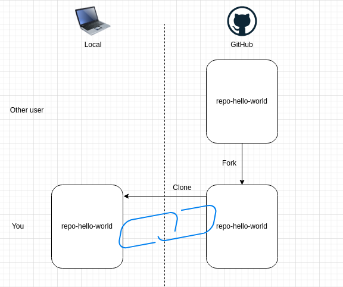
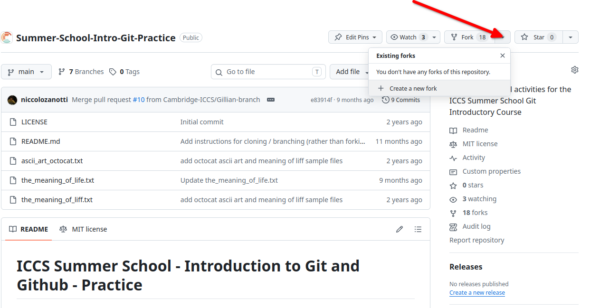
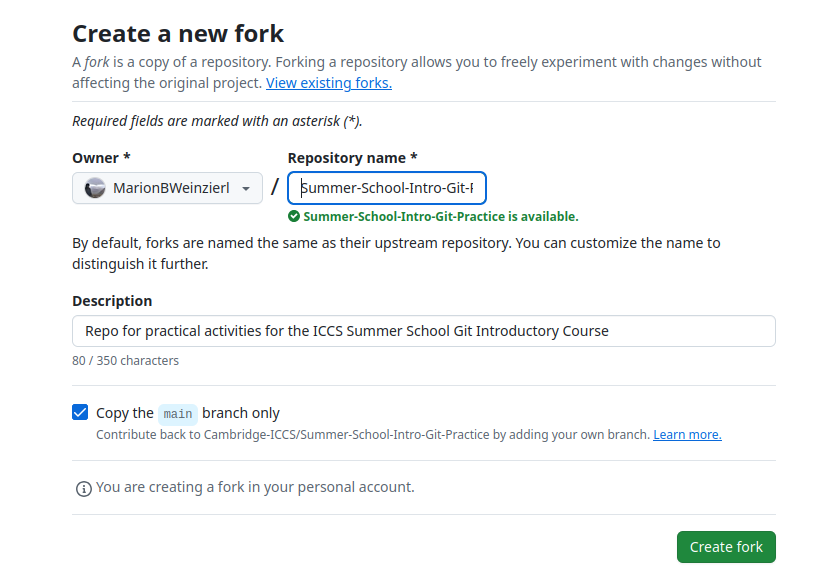
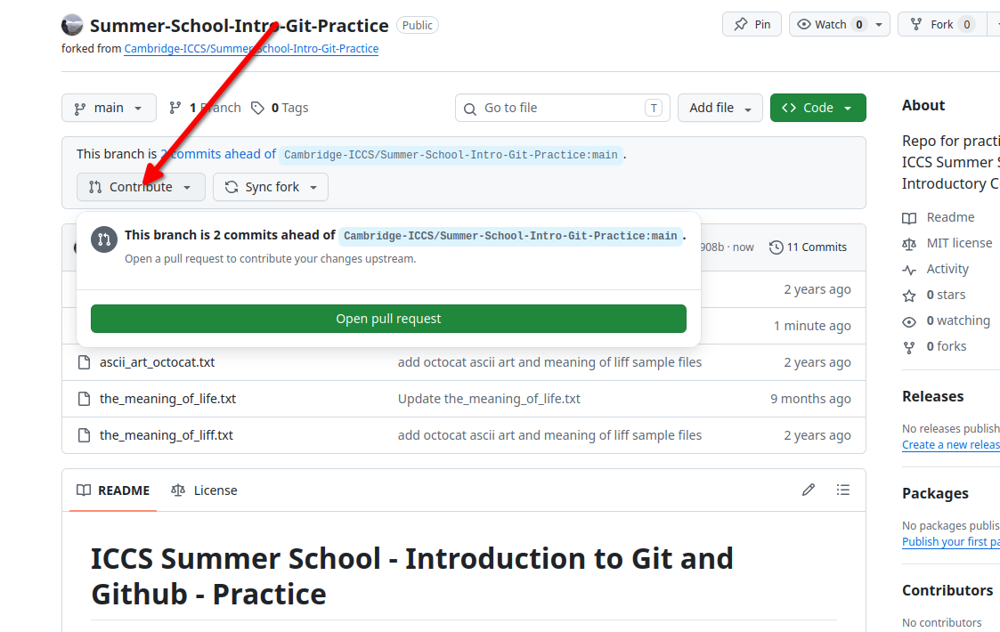
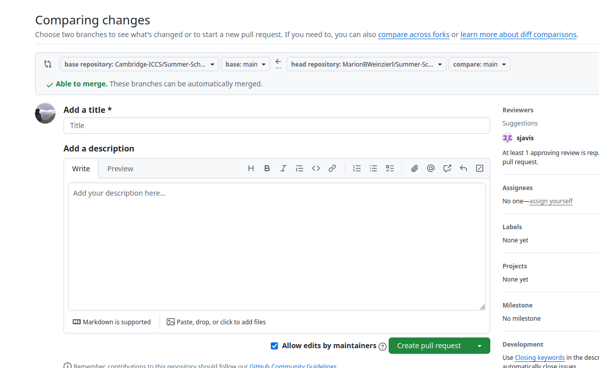
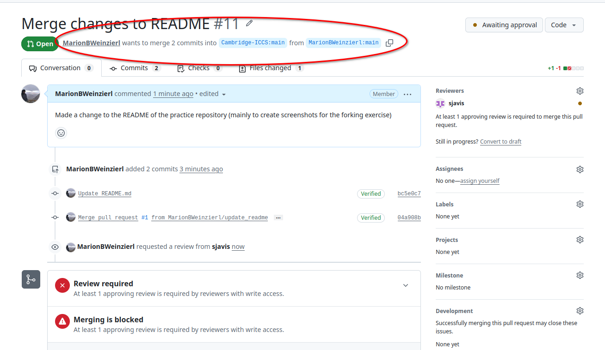
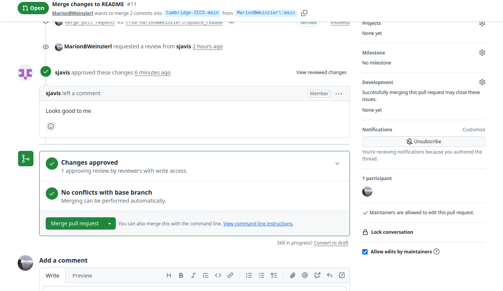
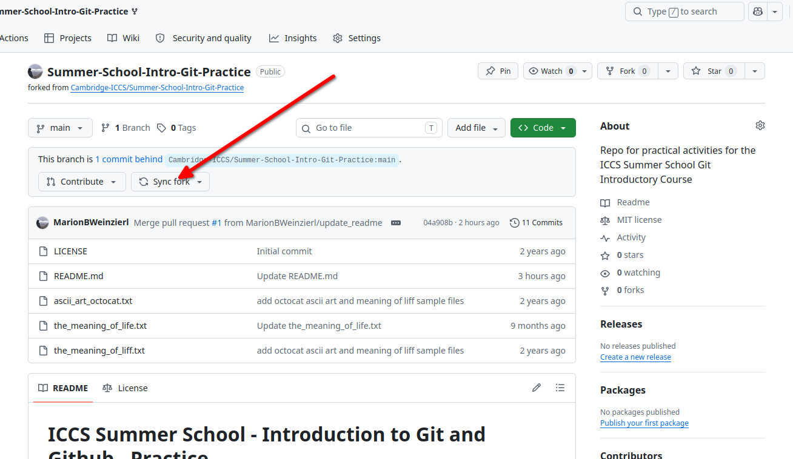
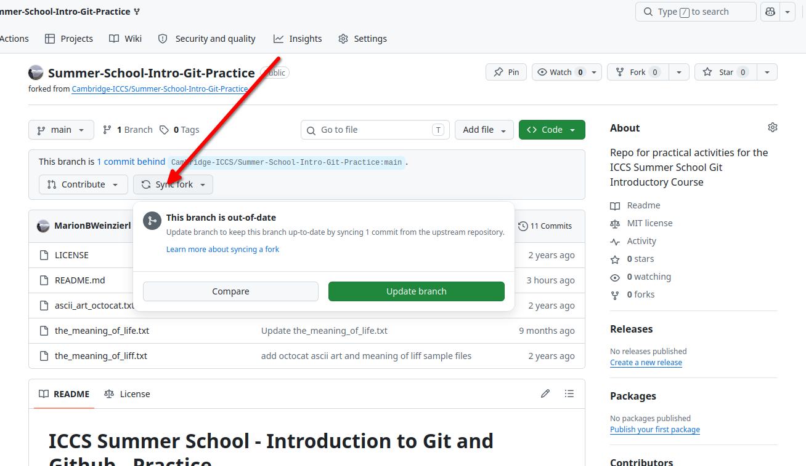
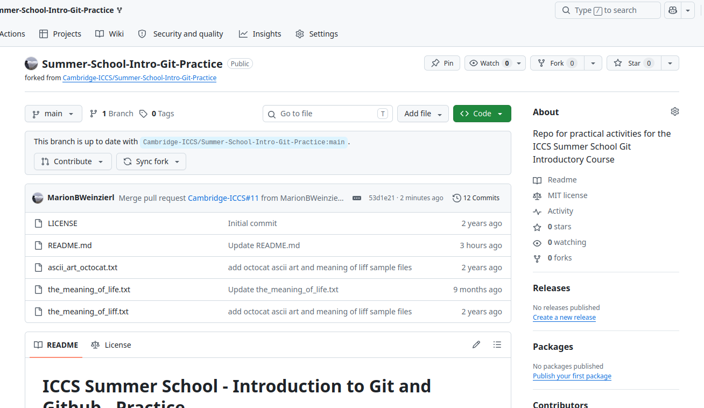

## Forking

:::: {.columns}

::: {.column width="50%"}
Reminder:

Forking creates another separate version of the repo remotely that you own. 

Once you have forked a repo remotely, you can then clone it to your local machine. You can still contribute to the original repository through a pull request.
:::

::: {.column width="50%"}

:::

::::

## Forking Exercise

 
 

Use the practice repo we used for the cloning exercise and follow the steps outlined in the next slides to fork the repository, clone the fork and contribute back to the original repository.

 

[https://github.com/Cambridge-ICCS/Summer-School-Intro-Git-Practice](https://github.com/Cambridge-ICCS/Summer-School-Intro-Git-Practice)

::: {.column-margin style="text-align: left;"}

:::

## Forking in Github

{width=80%}

## Forking in Github

{width=80%}

## What now? 

 
 

At this point, the forked repo only exists in GitHub. To work on it locally it needs to be copied ("cloned") to your local computer.

 

From here, you can continue working normally with your local clone and your forked remote repository.

## Contributing back from fork

 
 

But what if you want to contribute your changes back to the original repository after all?

## Contributing back from fork

{width=80%}

## Contributing back from fork

{width=80%}

## Contributing back from fork

{width=80%}

## Contributing back from fork

{width=80%}

## Sync local repo

 
 

You can also merge in new changes from the remote repository

## Sync local repo

{width=80%}

## Sync local repo

{width=80%}

## Sync local repo

{width=80%}

## That's it! 

 
 

You can continue working in your forked repo, and contribute back to the original repo if you wish.

